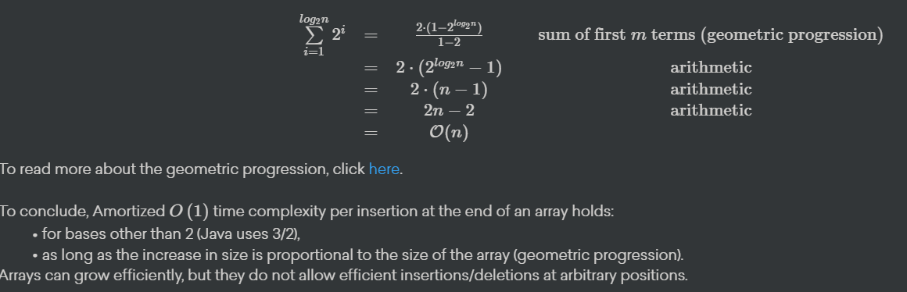

# Big Oh Notation

# Asymptotic Growth Comparison

The following functions are from 'best' asymptotic growth to 'worst':

1. **Constant:** *f*(*n*)=*c*
2. **Logarithmic:** *f*(*x*)=log(*n*)
3. **Linear:** *f*(*n*)=*n*
4. **Linearithmic (n-log-n):** *f*(*n*)=*n*log(*n*)
5. **Quadratic:** *f*(*n*)=*n^*2
6. **Cubic:** *f*(*n*)=*n^*3
7. **Polynomials:** *f*(*n*)=*n^a*
8. **Factorial:** *f*(*n*)=*n*!
9. **Exponential:** *f*(*n*)=*a^n*
10. **Worst ever:** *f*(*n*)=*n^*

# Tricks

## **Gauss's sum identity:**

$$
\sum_{i=1}^ni=1+2+3+...+\left(n-1\right)+n=\frac{n\left(n+1\right)}{2}∑i=1ni=1+2+3+...+(n−1)+n=2n(n+1)
$$

## Geometric sum:

$$
∑a^i=1+a+a2+...+an=1−ra1(1−rm)
$$

-*m* is the number of terms, in this case *n*

-*a*1 is the first term, in this case 1

-*r* is the constant that each term is multiplied by to get the next term, in this case *a*

## Don't know the name

$$
1+2+...+2^{k-1}=2^k-11+2+...+2k−1=2k−1
$$

# Time complexity of recursive algorithm

There are multiple steps to this:

1. State / define the size of the input n
2. State the recurrence equation by counting operations. The exact amount of operations shouldn't be counted, that depends on the hardware, compiler and much more. So it is more about counting loops etc. Specific operations can be replaced by a constant, often called *cx* where *x* is a number
3. Create a form of this recurrence equation where there is *T*(*n*) in the equation anymore. There are 2 methods to do so:
    1. Making an educated guess and then proving this (by induction)
    2. Unfolding the equation and then create a final equation based on that
4. Determine the complexity in big O notation
5. Prove the complexity in big O notation

# [Complexity Analysis](https://www.notion.so/Algorithms-and-Data-Structures-fb37f2c092f245eb87deaeaec908ad6a)

Complexity Analysis boils down to analyzing the efficiency of an algorithm. This efficiency is measured by two elements:

- Time complexity - The amount of time it takes for a given algorithm to execute.
- Space complexity - The amount of space a given algorithm uses at most during execution.

### Empirical Time analysis

Empirical time analysis is an analysis method for time complexity that is roughly equivalent to a brute force approach when programming or a proof by exhaustion for Reasoning and Logic. You simply execute the algorithm and measure the time it takes to finish.

```java
long startTime = System.currentTimeMillis();// record the starting time
/* (run the algorithm) */
long endTime = System.currentTimeMillis();// record the ending time
long elapsed = endTime - startTime;// calculate the elapsed time
```

**Problems with empirical time analysis**

The most prominent problems with empirical time analysis are the following:

- Results may differ when different hardware / compiler / OS / etc. are used.
- Experiments are restricted to a limited set of inputs.
- Requires a full implementation of the algorithm.
- A compiler may optimize your code or require a warm up time.

## Theoretical complexity analysis for time

Theoretical complexity analysis for time is a way to analyse the efficiency of an algorithm without having to run additional code. In fact, you don't even need to execute your algorithm to analyse it.

What we do is, we assign a mathematical function to the algorithm that describes the running time.

$T_{algorithm}(n)=\text{"number of primitive operations performed for an input size n"}$

Number of primitive operations performed. What does this mean? Primitive operations are operations that have a run time of 1.

We consider the following primitive operations:

- Assigning a value to a variable
- Performing an arithmetic operation
- Comparing two numbers ( and no more than two)
- Accessing a single element of an array by index
- Calling and returning from a method

When setting up this  $T_{a\lg orithm}\left(n\right)$ we go through a number of steps:

1. State the size of the problem *n* . Most often this is the length of  n
2. Simplify the program to only using primitive operations (optional).
3. Express the running time by counting operations.

*! Note that when expressing the running time, we consider the worst-case of our problem* n .

*! Note that a + only represents an arithmetic operation when applied to numbers.*

## Theoretical complexity analysis for space

Space complexity differs from time complexity in the sense that space used can go down, while time can not. You could say that space can be reused, while time is gone forever after it has been used. That's why we only look at the most space used at any given time during the execution of an algorithm when analyzing its space complexity. Where we counted the number of primitive operations performed for time complexity, for space complexity we count the number of stack frames used.

$S_{algorithm}(n)=\text{"maximum amount of memory needed at any point in the algorithm for an input size n"}$

To do this you have to remember that a stack frame is added or **pushed** onto the stack when a method is called and is only removed or **popped** off the stack when you return from the method. This means that with a recursive method, it is possible to have multiple stack frames on the stack at once.

## Big O proof

If we have a formula and a claimed Big O notation of that formula, we can prove whether this is the correct one. To prove this we first have to understand what it means for a Big O Notation to be correct. A Big O Notation $O\left(g\left(n\right)\right)O(g(n)) O\left(g\left(x\right)\right)$of a function $f\left(n\right)$ is correct if there is a positive constant c such that    $f\left(n\right)\ \le\ c\ \cdot g\left(n\right)f(n) ≤ c ⋅g$ and there  is n such that n > n0

# LinkedLists, Arrays, Queues and Stacks

## Array definition:

- all elements are the same type
- fixed length
- elements are accessed by index

## Operations:

- **Inserting:** inserting at a certain index is done by shifting all subsequent elements forward (updating the references) and then filling the 'empty' slot
- **Removing:** removing at a certain index is done by shifting all subsequent elements backwards (updating the references)
- **Insertion sort:**
- Start at index 1
- Scan array from left to right, one element at a time. Place that element in a temporary variable.
- Compare with previous elements (from the back to the front) and check where the element should be placed
- **Expanding capacity:** make a deep copy into a larger array, an expansion with at most *n* additional positions take up O(n) time and O(n) space
- **Clone** makes a shallow copy, it makes an object but it reference the original.
- **Deep copy**: makes identical copies of what is inside the original array (is recursive)

For an array with **n** elements, the following operations have the time complexity:

- insert at end O(n)
- insert at end O(1)
- access O(1)
- remove O(n)
- clone O(n)

## (Dis)advantages:

- *Advantages:* it keeps elements in a specific order and they are efficiently accessible by index
- *Disadvantages:* it has a predetermined fixed size which is costly to expand, insert or delete

# **Linked Lists**

# Disclaimer

All the methods marked with ****** are methods which could be used internally, but aren't part of the spec, meaning, you can't use those methods!

# Singly Linked List (SLL)

*This is about chapter 3.2, 3.5.2 and 3.6.2 in the textbook*

## SLL definition:

- A list is a sequence of nodes starting from a **head** pointer.
- Each node will **reference** to an element and another node.
- Last node is the **tail** of a node, its next reference is null.
- The way we move through the list we call **traversal**, we jump from node to node.

## Operations:

- **Insert at the head:** To insert we create a new node with as reference null, then we insert this new node to the list by referencing it to the head. We only need to update our head pointer to the new first node in the list. The new node was a local variable, which will be cleaned up by garbage collection (in Java).
- **Insert at the tail:** The only way to find the tail is by traversing the list (this is highly inefficient). We fix this by “cheating” by creating a new reference directly to the tail. Than we update the old tail to the new tail (which is the element we inserted).
- **Remove the head:** We update the head pointer to the new head and the garbage collection will clean the previous head
- ***Remove the tail:** Traverse the list to find the node before the tail, then set the 'next' reference of that node to **null.** The previous tail node will be cleaned by garbage collection.

For a list with **n** elements, the following operations have the time complexity:

- *****Access element by index *O*(*n*)
- *****Search element  *O*(*n*)
    
    -Insert element
    
    **at the head** *O*(1)
    
    **at the tail** *O*(1)
    

      -Removing element

     **at the head** *O*(1)

******at the tail *O*(*n*)

- *****Clone/copy array *O*(*n*)

## (Dis)advantages:

- *Advantages:* it grows efficiently as needed
- *Disadvantages:* accessing elements requires traversal, can't easily remove tail or in the middle

# Circularly Linked List (CLL)

*This is about chapter 3.3 in the textbook*

## CLL definition:

- It is a **SLL** but the **tail**'s **next** points to **head**, instead of **null** (so there's no explicit head)

## Operations:

- **Rotate:** sets the tail to the next element
- **Insert at the head:** We need to create a new node, set the **next** reference to the **“tail.next”** reference. Then we need to update the **tail.next** reference so it points to the new node. Again new node is a local variable in the method, so it will not exist after performing the operation.
- **Insert at the tail:** Insert the first node at the **head**, then you need to update the **tail** reference to the new node.
- **Remove the head:** Get an explicit pointer to the head, if identical to tail (length == 1), set **tail** to **null**. Otherwise, set **tail**'s **next** to **head**'s **next**.

For a list with **n** elements, the following operations have the time complexity:

- *****Access element by index *O*(*n*)
- *****Search element *O*(*n*)

Insert element

**at the head** *O*(1)

**at the tail** *O*(1)

Removing element

**at the head** *O*(1)

******at the tail *O*(*n*)

- *****Clone/copy array *O*(*n*)

## (Dis)advantages:

- *Advantages:* it grows efficiently as needed, natural representation of cyclic data
- *Disadvantages:* accessing elements requires traversal, can't easily remove tail or in the middle

# Doubly Linked List (DLL)

*This is about chapter 3.4 in the textbook*

## DLL definition:

- Each node contains a element, next reference and prev reference.
- There are two dummy nodes (**header** and **trailer**), which only include references. They avoid the need voor special cases. You don’t need them, it is handy to do so (seems like it is really important)
- Creation of DLL:
- **Create header**: element, prev and next all have values **null**
- **Create trailer:** element and next have values **null** and prev has value **header**
- Point **header**'s **next** to **trailer**

## Operations:

- ***Insert at element:** Create a new node, set the **prev** pointer to the predecessor and the **next** to the successor node. Then update the references on the predecessor and successor nodes to point to the newly created node
- ***Remove at element:** If you want to remove node (**node**), ****get predecessor (**pred**) and successor (**succ**) nodes, set **pred.next = node.next** and **succ.prev = node.prev**
- **Insert** **at the head:** Insert node between **header** and **header.next**
- **Insert at the tail**: Insert node between **trailer** and **trailer.prev**
- **Remove the head:** Point the **header.next** to **header.next.next**
- **Remove the tail:** Point the **trailer.prev** to **trailer.prev.prev**

For a list with **n** elements, the following operations have the time complexity:

- *****Access element by index *O*(*n*)
- *****Search element *O*(*n*)

Insert element

**at the head** *O*(1)

**at the tail** *O*(1)

Removing element

**at the head** *O*(1)

**at the tail** *O*(1)

- *****Clone/copy array *O*(*n*)

## (Dis)advantages:

- *Advantages:* it grows efficiently as needed, efficient insertion/deletion at head and tail
- *Disadvantages:* accessing elements requires traversal, added space for **prev** references

# **Stacks**

## Stack definition:

- Stack (pile) of elements
- We can only access/modify the top of the stack
- Using the **last-in**, **first-out** principle (**LIFO**):
- Elements can be inserted at any time
- Only the last inserted element (top of stack) can be accessed or deleted
- A stack is an **Abstract Data Type (ADT),** it is an abstraction of a data structure, it cannot be instantiated. It contains:
- Signatures of operations on the data structure
- Perhaps constants, default or static methods

## Operations:

- **Push:** insert element onto the stack
- **Pop:** remove element from the top of the stack
- **Top/peek:** access top element without removing it
- **Size:** get the size of the stack
- **isEmpty:** returns whether the stack is empty

## Implementations:

There are a few types of implementations of stacks:

- **Array-based:**
- Stores elements in an array of **fixed** capacity*C*
- **Top** element: index*t*, at the end of the array, proving efficient insertion/deletion
- Stack size: **t+1*t*+1** (as it's zero-indexed)
- **List-based:**
- **Top** is the **head** of the list, for efficient insertion/deletion
- It reuses **SLL** methods (**adapter** design pattern)

## Complexity

**Space**

Array: fixed capacity so wastes space if overdimensioned and costs time if underdimensioned

List: grows efficiently but uses more space per element than the array

Time O(1) all operations

# **Queues**

## Queue definition:

- Collection of objects
- Using the **first-in**, **first-out** principle (**FIFO**):
- Elements can be inserted at any time
- Only the element that has been the longest in the queue can be accessed or deleted

## Operations:

- **Enqueue:** adds element to the tail of the queue
- **Dequeue:** removes & returns the head element
- **First:** access top element without removing it
- **Size:** get the size of the queue
- **isEmpty:** returns whether the queue is empty

## Circular queue:

Used to add the front element to the end. Almost the same as a queue, but now with an extra **rotate** operation to do so efficiently (comparable to **CLL**). So this has a tail and an implicit head, which it shifted on each **rotate** operation.

# Double-ended queue (deque)

## Deque definition:

- Almost the same as a queue, but then people are removable from the front and the tail

## Implementations:

- **Array-based**
    - Just like in the queue, we should use a circular array
    - Now, when we insert from the front, we should decrement in a circular fashion and make sure it doesn't become negative
- **List-based (DLL);**
    - It already is a deque

    # Week 3 - Positional Lists, Iterators, Priority Queues, Heaps, Search Algorithm

# List Abstractions

The following operations are part of the Java List interface:

- *size()* > gets the size
- *isEmpty()* > gets whether the list is empty
- *get(i)* > gets the element at index
- *set(i, e)* > replaces the element at index
- *add(i, e)* > adds the element from index
- *remove(i)* > removes the element from index

### Array implementation

Usual insertion / deletion algorithm for arrays, but if the max capacity of array is reached, insertion at the end goes from O(n) to much larger. But this happend rarely, so we think about amortised complexity. Size doubling happend when n is a power of 2. Thus, there are O(log n) operations of resizing each with cost O(2^i) where i is in {1,2, … log n} → 



### Positional List based

An array element can easily be accessed by index, but the index can shift as new items get added and old items get removed. In order to add or get an element at an arbitrary position in a list we can use a positional list. This list uses a position interface which describes only 1 method: *getElement().* Internally, this interface is implemented with more methods; for example *next* and *prev.* This means that the you can't call those methods as they are not in the *Position* interface, but using a direct reference to the class which implements the interface you can. So we encapsulate those methods so that you can't traverse the list outside of the positional list class. 

The following methods are in the positional list spec:

- *before(p) / after(p)*
- *addBefore(p, e) / addAfter(p, e)*
- *set(p, e)*
- *remove(p)*

## Iterator

- Lazy Iterator
    - goes through the list normally but if the list changes while iterator is iterating, the iterator will also change
- Snapshot Iterator
    - - makes a copy of the collection upon creation, so if the list changes while it is iterating, the iteration will not be affected (because it s working on a copy)

# Priority Queue

A priority queue is a collection of prioritized elements.

- insert at any arbitrary position (when you insert / enqueue it doesn’t go at the end, it goes where it would be in the right order depending on the property it s sorted by)
- remove element with the first priority

Priority Queue Entry (key, value)

- key is priority, it s what gives the priority
- value is the element

## Comparable

- Natural Ordering: a class defines a natural ordering of instances by implementing java.lang.comparable
- External Ordering: can be defined by another class: java.util.Comparator

### Operations on PQ:

- insert (k,v)
- min () return minimum key
- removeMin() take a guess
- size()
- isEmpty()

If you use *min* and *removeMin* with elements that have the same key, the returned value is arbitrary

**Priority**: A key associated with an element establishes its **priority**, usually numeric can be anything as long as there is a natural order.

For a comparison to be self-consistent, it must define a total order relation:

- *Comparability*: The rule is defined for every pair of keys
- *Anti-symmetry*: If the rule holds independently of the order of keys, the keys must be identical
- *Transivity*: if *aRb* and *bRc* then *aRc*
- *Reflexivity*: *aRa*

Minimal key is always: *kmin*≤*k* where *k* are all the other keys in the queue

Implementations:

- Unsorted List: addition is done at the end in O(1) and removal is O(n) (it searches for min and then removes it)
- Sorted List: addition is O(n) because it should be added in the right spot and then removal is O(1) from the end
- Heap (see heaps)


### Adaptable Priority Queue

It s a priority queue with bonus:

- Remove (remove entry from pq)
- replaceKey (replaces the key of an entry with new key) // probably would need re insertion
- replaceValue (replaces value of an entry with a new value)

### Implementations of Adaptable PQ

- To implement these new methods efficiently, we need to store the location of each entry in the underlying structure (e.g. array) in the entry itself. So we would store the index of the entry in the entry if we are working with an array
    - For example, for Element x = pq.removeMin(), x has x.getIndex() which returns the index at which it was stored in the array.
    
    
    

# Heaps. (warning ! it s harder)

### Definition

- Heap is an efficient realization of a PriorityQueue that allows insertion and removal in O(n) time by thinking about it as a BinaryTree.

A heap is a complete binary tree storing entries as positions. All levels except possible the last are full (level i has 2^i nodes for 0≤ i≤ h -1  where h  is the height of the heap)

The remaining nodes in the last level occupy the leftmost positions.

Heap Order for every position p except the root, the key at p is greater or equal to the key of its parent (so the root is the smallest element)

Height is log (n) where n is nr of elements

- max heap is the heap where the root is the max element
- min heap is where root is min element

# Operations

### Insert

- create new node
- to preserve heap order, (q parent, p is node), compare key to its parent, if order not satisfied, swap
- Up Heap Bubbling start at the bottom, each pairwise swap between a node and its parent either
    - re establishes heap order
    - propagates the issue one level up
        - O(log n) complexity (because log n levels)

### RemoveMin

- entry with min is the root
- we cant delete root to preserve completness, we replace root with last node and then we down - bubble
    - then remove last entry

## Implementations:

- arrays: especially suited for complete binary trees (heaps), for node at index p, 2p+1 is left child, 2p+2 is right child !!!!!!!!!!
- linked tree
    - locating last pos is O(1), O (log n ) in total
    - local swapping between parrent/child
        - for accessing, Array is O(1) but tree alwasys requires traversal for access, so it ‘s O(log n)

## Heap Construction

- Bottom up heap merging
    - we take 2 heaps and add new key
    - we make the key the root and the 2 heaps it s children
    - we use down heap bubbling to restore heap order
- Bottom up heap construction
    - we start with empty heap and insert method for every new key
    - every iteration we insert n+1/2i nodes, where i is the number of the iteration. Then we perform up heap bullbing to restore heap order
    - after hitting root node we re done
- This takes O(n).


## Down Heap bubbling

- for min heap
    - swap with child with smallest key until we reach end of tree
- for max heap
    - swap with biggest child until we reach down
    
    ```java
    package weblab;
    
    import java.util.*;
    
    class MaxHeap {
    
        int[] arr;
    
        int size;
    
        // All methods below are available to use in your solution
    
        /**
         * Returns the number of elements in the heap.
         *
         * @return the current number of elements in the heap
         */
        public int size() {
            return this.size;
        }
    
        /**
         * Retrieves and removes the first element of this heap.
         *
         * @return The first element of the heap.
         */
        public int poll() {
            if (size == 0) {
                throw new NoSuchElementException("Cannot poll empty heap!");
            }
            int res = arr[0];
            swap(0, --size);
            arr[size] = 0;
            downHeap(0);
            return res;
        }
    
        /**
         * Turns the array of integers into a heap.
         * This is an in-place algorithm, the heap is built in the array itself.
         * <p>
         * On return, this heap's array represents a valid heap.
         */
        protected void heapify() {
            int n = this.arr.length - 1;
            for (int i = (n - 1) / 2; i >= 0; i--) downHeap(i);
        }
    
        /**
         * Restores the heap property in a heap represented as an array
         * by performing upheap on a certain item.
         *
         * @param index Index of the node to perform upheap on.
         */
        protected void upHeap(int index) {
            while (index >= 1) {
                int j = (index - 1) / 2;
                if (arr[j] >= arr[index]) break;
                swap(j, index);
                index = j;
            }
        }
    
        /**
         * Swaps two elements in the array.
         *
         * @param i Position of element to swap.
         * @param j Position of element to swap.
         */
        protected void swap(int i, int j) {
            int t = arr[i];
            arr[i] = arr[j];
            arr[j] = t;
        }
    
        /**
         * Creates a new MaxHeap with an initial capacity of 4 elements.
         */
        public MaxHeap() {
            this.arr = new int[4];
            this.size = 0;
        }
    
        /**
         * Restores the heap property in a heap represented as an array
         * by performing downheap on a certain item.
         * This method takes O(log n) time.
         * Ties may be broken arbitrarily.
         *
         * @param index Index of the item to perform downheap on.
         *              You can assume the index given is always valid.
         */
        void downHeap(int index) {
            int left = 2 * index + 1;
            int right = 2 * index + 2;
            int largest = index;
            if (left < size && arr[left] > arr[largest]) {
                largest = left;
            }
            if (right < size && arr[right] > arr[largest]) {
                largest = right;
            }
            if (largest != index) {
                swap(index, largest);
                downHeap(largest);
            }
        }
    }
    ```
    

# Tree traversals

## InOrder traversal of the tree: (root is in)

- traverse left subtree
- visit root
- traverse right subtree

```java
public static void InOrder(Node node) {
        if (node == null) {
            return;
        }

        InOrder(node.left);

        /* then print the data of node */
        System.out.print(node.key + " ");

        /* now recur on right child */
        InOrder(node.right);
    }
```

## PreOrder traversal: (the root is pre)

- visit root
- traverse left subtree
- traverse right subtree

```java
void printPreorder(Node node)
    {
        if (node == null)
            return;
 
        /* first print data of node */
        System.out.print(node.key + " ");
 
        /* then recur on left subtree */
        printPreorder(node.left);
 
        /* now recur on right subtree */
        printPreorder(node.right);
    }
```


## PostOrder traversal: (root is post)

- visit left subtree
- viist right subtree
- visit root

```java
void printPostOrder(Node node)
    {
        if (node == null)
            return;
 
        /* first recur on left subtree */
        printPreorder(node.left);
 
        /* now recur on right subtree */
        printPreorder(node.right);

				/* print data of node */
        System.out.print(node.key + " ");
    }
```

## Breadth first traversal

Visit every node level by level.

```java
void BFS(int s)
    {
        // Mark all the vertices as not visited(By default
        // set as false)
        boolean visited[] = new boolean[V];
 
        // Create a queue for BFS
        LinkedList<Integer> queue = new LinkedList<Integer>();
 
        // Mark the current node as visited and enqueue it
        visited[s]=true;
        queue.add(s);
 
        while (queue.size() != 0)
        {
            // Dequeue a vertex from queue and print it
            s = queue.poll();
            System.out.print(s+" ");
 
            // Get all adjacent vertices of the dequeued vertex s
            // If a adjacent has not been visited, then mark it
            // visited and enqueue it
            Iterator<Integer> i = adj[s].listIterator();
            while (i.hasNext())
            {
                int n = i.next();
                if (!visited[n])
                {
                    visited[n] = true;
                    queue.add(n);
                }
            }
        }
    }
```

## Full binary tree

A tree where every node has either 0 or 2 children

## Complete binary tree

When all of the levels of a binary tree are entirely filled, except for the last level, which can contain 1 or 2 children nodes and is **filled from the left**, it is said to be a complete binary tree.

- also! The keys stored at each node of the tree must be comparable according to a total order relations of comparability, antisymmetry, and transitivity.

### N-ary tree

- tree where every node has a maximum (≤) of n children
    - a binary tree is a 2-ary tree

    
# Maps, Hashing, Sorted Maps, Sets, MultiMaps and MultiSets

# Maps

- maps a value to a key
- set of pairs of Key, Value

### Hashing

In the context of maps, hashing is a technique used to map keys to values. A hash table is a data structure that stores a collection of key-value pairs, where each key is mapped to a specific value using a hash function.

The hash function takes an input (also called a key) and produces an output (called a hash code or index) that is used to store the key-value pair in the hash table. The goal of the hash function is to generate a unique index for each key, so that it can be quickly retrieved or searched for in the table. The process of determining the index for a key is called hashing.

When a key-value pair is added to the hash table, the key is passed through the hash function to produce an index, and the value is stored at that index. When a value is requested for a key, the key is passed through the hash function again to determine the index where the value is stored, and the value is then returned.

There are 2 ways of dealing with collisions inside of a map:

- separate chaining
- linear probing

### Separate Chaining

Separate chaining is a collision resolution technique used in hash tables to handle the case when two or more keys have the same hash code. The basic idea behind separate chaining is to create a linked list for each index of the hash table, where each node of the list stores a key-value pair.

When a new key-value pair is added to the hash table, the key is passed through the hash function to determine the index where the pair should be stored. If the index is empty, the pair is added as the head of the new list. If the index is already occupied, the pair is added as a new node at the end of the list.

When a value is requested for a key, the key is passed through the hash function again to determine the index of the list where the key might be located. The algorithm then searches through the list for the key, and returns the associated value if the key is found.

The time complexity of operations in a hash table with separate chaining is affected by the number of collisions. In the worst-case scenario, where all the keys hash to the same index, the time complexity of each operation becomes O(n), where n is the number of keys stored in the table. In the best-case scenario, where there are no collisions, the time complexity of each operation is O(1).

Advantages of Separate Chaining:

- Simpler to implement than other collision resolution techniques
- It can be used with any hash function, not only with specific ones
- Not subject to clustering, where all the keys hash to a small number of indices
- Load factor can be kept low in order to keep good performance

Disadvantages of Separate Chaining:

- Increased memory usage due to the additional storage required for the linked lists.
- Performance degrade as the load factor increase, and worst-case time complexity becomes O(n)

### Linear Probing

Linear probing is a collision resolution technique used in hash tables to handle the case when two or more keys have the same hash code. The basic idea behind linear probing is to find the next open slot in the hash table when a collision occurs.

When a new key-value pair is added to the hash table, the key is passed through the hash function to determine the index where the pair should be stored. If the index is empty, the pair is added to the table at that index. If the index is already occupied, the algorithm checks the next index, and if that index is also occupied, it continues checking the next index until an empty slot is found. The key-value pair is then added to the first empty slot that is found.

When a value is requested for a key, the key is passed through the hash function again to determine the index where the key might be located. If the index is empty, the key is not in the table and a null value is returned. If the index is occupied, the algorithm checks the key at that index. If the key at that index matches the requested key, the associated value is returned. If the key at that index does not match, the algorithm checks the next index, and continues checking until either the key is found or an empty slot is encountered.

The time complexity of operations in a hash table with linear probing is affected by the number of collisions. In the worst-case scenario, where the hash table becomes full, the time complexity of each operation becomes O(n), where n is the number of keys stored in the table. In the best-case scenario, where there are no collisions, the time complexity of each operation is O(1).

Advantages of Linear Probing:

- Simple to implement
- Cache-friendly, since the keys are stored in a contiguous block of memory

Disadvantages of Linear Probing:

- Clustering: As keys are added, keys that hash to nearby indices cluster together. This could lead to an increase in collisions and degrade the performance of the hash table.
- Load factor should be kept low, to avoid clustering and maintain good performance

## Sorted Map

Is a map in which the keys are always sorted.

methods:


# Sets

 In Java, the **`Set`** interface is a member of the Java Collections Framework. A set is a collection that cannot contain duplicate elements. The **`Set`** interface provides methods for accessing the elements of a finite mathematical set. Some of the most commonly used implementation classes of the **`Set`** interface in Java include **`HashSet`**, **`TreeSet`**, and **`LinkedHashSet`**.

**`HashSet`** is a class that implements the **`Set`** interface. It uses a **`HashMap`** to store the elements of the set. The **`HashSet`** class is not ordered and does not guarantee any specific order of the elements. It is efficient for searching, adding and removing elements.

**`TreeSet`** is another class that implements the **`Set`** interface. It uses a **`TreeMap`** to store the elements of the set, which means that the elements are sorted according to their natural ordering, or according to a **`Comparator`** provided at the time of creation of the **`TreeSet`** instance.

**`LinkedHashSet`** is similar to **`HashSet`** but it maintains the insertion order of elements. So it is faster than **`TreeSet`** but slower than **`HashSet`**.

# Multisets

In Java, a "multiset" is a type of data structure that is similar to a set, but allows for duplicate elements to be stored. One way to implement a multiset in Java is to use a HashMap where the keys are the elements in the multiset and the values are the counts of how many times each element appears in the multiset. Here's an example of a basic implementation of a multiset using a HashMap → 

The above code defines a generic MultiSet class that stores elements of type T. The class has an instance variable called "map" that is an instance of HashMap<T, Integer>. The map stores the elements of the multiset as keys and the number of occurrences of each element as values.

This is just one way to implement a multiset in Java, and there are many different libraries and data structures that can be used to accomplish this. For example, Guava library provides a **`Multiset`** implementation and the Apache commons-collections library also has a **`MultiSet`** implementation.

Note that, This is just a skeleton of the implementation, in practice, you would also want to add more functionality to the class, such as iterating over the elements, checking if the multiset is empty, getting the size of the multiset, etc.

# Multimaps

A MultiMap is a map that allows multiple values to be associated with a single key. In other words, it is a map that can map a single key to multiple values. The implementation of a MultiMap in Java is often done using a Map of List or Set objects.

For example, let's say you have a MultiMap that stores information about people and their favorite colors. Each person is represented by a key, and their favorite colors are the associated values. The map would look something like this:

```java
import java.util.HashMap;
import java.util.Map;

public class MultiSet<T> {
    private Map<T, Integer> map;

    public MultiSet() {
        map = new HashMap<>();
    }

    public void add(T element) {
        int count = map.getOrDefault(element, 0);
        map.put(element, count + 1);
    }

    public void remove(T element) {
        if (map.containsKey(element)) {
            int count = map.get(element);
            if (count > 1) {
                map.put(element, count - 1);
            } else {
                map.remove(element);
            }
        }
    }

    public int count(T element) {
        return map.getOrDefault(element, 0);
    }
}
```

```java
**John -> [Red, Blue]
Jane -> [Green, Yellow]
Bob -> [Red]**
```

```java
import java.util.ArrayList;
import java.util.HashMap;
import java.util.List;
import java.util.Map;

public class MultiMap<K, V> {
    private Map<K, List<V>> map = new HashMap<>();

    public void put(K key, V value) {
        if (!map.containsKey(key)) {
            map.put(key, new ArrayList<>());
        }
        map.get(key).add(value);
    }

    public List<V> get(K key) {
        return map.get(key);
    }

    public void remove(K key, V value) {
        List<V> values = map.get(key);
        if (values != null) {
            values.remove(value);
            if (values.isEmpty()) {
                map.remove(key);
            }
        }
    }
}
```

# Time Complexity Example - recursive


# Sorting And Search Algorithms

# Sorting with a priority queue.

- Heap Sort, Selection Sort and Insertion Sort all use the following 2 phase way of sorting
- An application of a PQ is sorting, which can be done in the following 2 steps:
    - Insertion phase: Insert the elements of sequence S as keys into an initially empty PQ by insert operations, one for each element
    - Removal phase: Call remove min on the PQ and put those elements back in the array S.
    
    (To be noted that there are 3 ways to implement a PQ)
    
    - Heap
    - Sorted List
    - Unsorted List
    
    ## Selection Sort
    
    ### Time Complexity: O (n^2)
    
    - Sorting elements using an unsorted list PQ:
        - Insertion into PQ is O(1), so n insertions give O(n) for insertion
        - the removal phase is proportional to size of PQ because for every iteration of removeMin() it has to select the minimum, so O(n)
            - which gives a total of O(n^2) complexity
    
    ### Space complexity:
    
    Depends on implementation. If the sorted sequence S is a linkedList whose size if modified by insert/remove, the total nr of elements in S and P combined is always equal to the original number in S, giving a space complexity of O(1). (doesnt scale with n)
    
    ### In-Place implementation
    
    Selection sort can be implemented in place as well:
    
    - Iterate from left to right one index i at a time
    - find index m of minimum element within i, n-1
    - swap i and m
    
    ```java
    class SelectionSort
    {
        void sort(int arr[])
        {
            int n = arr.length;
            // One by one move boundary of unsorted subarray
            for (int i = 0; i < n-1; i++)
            {
                // Find the minimum element in unsorted array
                int min_idx = i;
    	            for (int j = i+1; j < n; j++)
                    if (arr[j] < arr[min_idx])
                        min_idx = j;
     
                // Swap the found minimum element with the first
                // element
                int temp = arr[min_idx];
                arr[min_idx] = arr[i];
                arr[i] = temp;
            }
        }
     
        // Prints the array
        void printArray(int arr[])
        {
            int n = arr.length;
            for (int i=0; i<n; ++i)
                System.out.print(arr[i]+" ");
            System.out.println();
        }
     
        // Driver code to test above
        public static void main(String args[])
        {
            SelectionSort ob = new SelectionSort();
            int arr[] = {64,25,12,22,11};
            ob.sort(arr);
            System.out.println("Sorted array");
            ob.printArray(arr);
        }
    }
    ```
    
    ## Insertion Sort
    
    ### Time complexity
    
    Using a sorted List PQ:
    
    - Insertion runtime performance is proportional to size of P, giving a total of O(n^2) (n for one insertion, n*n for n insertions)
    - removal is O(n)
    
    ### Space complexity
    
    - Space complexity is the same as Selection sort.
    
    ### In-Place implementation
    
    - Insertion sort can also be done in-place, so the space complexity is always O(1).
        - Iterate left to right, one index i at a time
        - iterate backwards from i to 0, and when current element is larger then index i, shift one position to the right. When the right position is found, insert the element at i in that position.
    
    ## 
    
    ```java
    public class InsertionSort {
        /*Function to sort array using insertion sort*/
        void sort(int arr[])
        {
            int n = arr.length;
            for (int i = 1; i < n; ++i) {
                int key = arr[i];
                int j = i - 1;
     
                /* Move elements of arr[0..i-1], that are
                   greater than key, to one position ahead
                   of their current position */
                while (j >= 0 && arr[j] > key) {
                    arr[j + 1] = arr[j];
                    j = j - 1;
                }
                arr[j + 1] = key;
            }
        }
     
        /* A utility function to print array of size n*/
        static void printArray(int arr[])
        {
            int n = arr.length;
            for (int i = 0; i < n; ++i)
                System.out.print(arr[i] + " ");
     
            System.out.println();
        }
     
        // Driver method
        public static void main(String args[])
        {
            int arr[] = { 12, 11, 13, 5, 6 };
     
            InsertionSort ob = new InsertionSort();
            ob.sort(arr);
     
            printArray(arr);
        }
    };
    ```
    
    ## Heap Sort (! careful here, it s hard)
    
    ### Time complexity
    
    - the ith insert operation takes O(log i) time, since the heap has i entries after the operation. Therefore, this takes O(n log n) time ( which could be O(n) using bottom up heap construction. After this all elements are inserted in a min-heap.
    - The removal can be done with removeMin(). The j th remove operation takes O(log (n-j+1)) since the heap has n-j+1 entries. This takes O(n log n) which is the time complexity for the entire algorithm.
    
    ### Space complexity:
    
    O(n).
    
    ### In-Place:
    
    In order to achieve in-place heap sorting we need to use a portion of the array for the heap  and the remaining portion for the sorted sequence. This can be done as follows:
    
    - We use a max-heap instead of a min-heap. At any point during the execution of the algorithm, we use the left portion of S up to a certain index i - 1 to store the entries of the heap, and right to store the elements of the sequence. So, the first i elements provide the array based representation of the heap.
    - In the first phase of the algorithm, we start with an empty heap and move the boundary between the heap and the sequence to the right, and we end up with the entire array used for the heap.
    - In the second phase of the algorithm we start with an empty sequence and we move this boundary to the left again, one step at a time, by removing the maximal element from the heap and storing it at n - i.
    
    ```java
    public class HeapSort {
        public void sort(int arr[])
        {
            int N = arr.length;
     
            // Build heap (rearrange array)
            for (int i = N / 2 - 1; i >= 0; i--)
                heapify(arr, N, i);
     
            // One by one extract an element from heap
            for (int i = N - 1; i > 0; i--) {
                // Move current root to end
                int temp = arr[0];
                arr[0] = arr[i];
                arr[i] = temp;
     
                // call max heapify on the reduced heap
                heapify(arr, i, 0);
            }
        }
     
        // To heapify a subtree rooted with node i which is
        // an index in arr[]. n is size of heap
        void heapify(int arr[], int N, int i)
        {
            int largest = i; // Initialize largest as root
            int l = 2 * i + 1; // left = 2*i + 1
            int r = 2 * i + 2; // right = 2*i + 2
     
            // If left child is larger than root
            if (l < N && arr[l] > arr[largest])
                largest = l;
     
            // If right child is larger than largest so far
            if (r < N && arr[r] > arr[largest])
                largest = r;
     
            // If largest is not root
            if (largest != i) {
                int swap = arr[i];
                arr[i] = arr[largest];
                arr[largest] = swap;
     
                // Recursively heapify the affected sub-tree
                heapify(arr, N, largest);
            }
        }
     
        /* A utility function to print array of size n */
        static void printArray(int arr[])
        {
            int N = arr.length;
     
            for (int i = 0; i < N; ++i)
                System.out.print(arr[i] + " ");
            System.out.println();
        }
     
        // Driver's code
        public static void main(String args[])
        {
            int arr[] = { 12, 11, 13, 5, 6, 7 };
            int N = arr.length;
     
            // Function call
            HeapSort ob = new HeapSort();
            ob.sort(arr);
     
            System.out.println("Sorted array is");
            printArray(arr);
        }
    }
    ```
    
    # Divide and conquer
    
    It s an algorithmic design pattern consisting of 3 steps 
    
    - Divide
        - Small input: base case
        - Larger input:  recurrence case, divide the input into 2 or more disjoint sets (no common elements)
    - Conquer
        - recursively solve the sub problems associated with the subsets
    - Combine
        - take the solutions of the small problems and merge them into the solution for the larger problem
    
    # Merge sort
    
    - Merge sort uses the divide and conquer method to sort  an array of n elements
        - divide
            - if S has 0 or 1 elements it returns
            - if S has ≥ 2 elements, split these in 2 sub arrays and S1 and S2. Each contain ~ n/2 elements
        - conquer:
            - recursively sort this sub arrays S1 and S2
        - Combine:
            - Put elements back into S*S* by merging the sorted sequences into a sorted sequence (this is done by repeatedly getting the minimum of the first values of both the sorted arrays)
        
        ### Time complexity
        
        - You can visualize the algorithm using a recursive tree which contains every recursive call in a tree shape. The height h of this tree is O(log n). The overall work done at every level i is O(n) as we have to make 2^+1 recursve calls and partition and merge 2^i sequences of size n / 2 ^ i
        - Total time complexity is O (n log n)
        
        ```java
        class MergeSort {
            // Merges two subarrays of arr[].
            // First subarray is arr[l..m]
            // Second subarray is arr[m+1..r]
            public static void mergeSort(int[] s) {
                int n = s.length;
                if (n < 2)
                    return;
        
                //divide
                int mid = n / 2;
                int[] s1 = Arrays.copyOfRange(s, 0, mid);
                int[] s2 = Arrays.copyOfRange(s, mid, n);
        
                // conquer
                mergeSort(s1);
                mergeSort(s2);
        
                //merge results
                merge(s1, s2, s);
            }
        
            public static void merge(int[] s1, int[] s2, int[] s) {
                int i = 0;
                int j = 0;
                while (i + j < s.length) {
                    if (j == s2.length || (i < s1.length && s1[i] < s2[j])) {
                        s[i + j] = s1[i++];
                    } else {
                        s[i + j] = s2[j++];
                    }
                }
            }
        }
        ```
        
        ## Merge Sort in-place
        
        This is the in place version of Merge Sort.
        
        This algorithm has a time complexity of O(n*log(n)), which makes it more efficient than many other sorting algorithms for large datasets. The space complexity is O(n), since the algorithm creates two new arrays to hold the left and right halves of the original array while it sorts them.
        
        ```java
        public static void mergeSort(int[] array) {
            // base case: if the array has length 1, it is already sorted
            if (array.length > 1) {
                // split the array into two halves
                int mid = array.length / 2;
                int[] left = Arrays.copyOfRange(array, 0, mid);
                int[] right = Arrays.copyOfRange(array, mid, array.length);
        
                // sort the two halves
                mergeSort(left);
                mergeSort(right);
        
                // merge the sorted halves back together
                merge(array, left, right);
            }
        }
        
        private static void merge(int[] array, int[] left, int[] right) {
            // index for the left array
            int i = 0;
            // index for the right array
            int j = 0;
            // index for the array
            int k = 0;
        
            // while both arrays have elements remaining
            while (i < left.length && j < right.length) {
                // compare the elements at the current indices
                if (left[i] < right[j]) {
                    // the left element is smaller, so add it to the array and increment the left index
                    array[k] = left[i];
                    i++;
                } else {
                    // the right element is smaller, so add it to the array and increment the right index
                    array[k] = right[j];
                    j++;
                }
                // increment the array index
                k++;
            }
        
            // add the remaining elements from the left array to the array
            while (i < left.length) {
                array[k] = left[i];
                i++;
                k++;
            }
        
            // add the remaining elements from the right array to the array
            while (j < right.length) {
                array[k] = right[j];
                j++;
                k++;
            }
        }
        ```
        
        # Merge Sort bottom up (non recursive)
        
        ```java
        public static void mergeSort(int[] arr) {
            int n = arr.length;
            int[] temp = new int[n];
        
            for (int size = 1; size < n; size = size * 2) {
                for (int leftStart = 0; leftStart < n - 1; leftStart += 2 * size) {
                    int mid = Math.min(leftStart + size - 1, n - 1);
                    int rightEnd = Math.min(leftStart + 2 * size - 1, n - 1);
        
                    merge(arr, temp, leftStart, mid, rightEnd);
                }
            }
        }
        
        public static void merge(int[] arr, int[] temp, int leftStart, int mid, int rightEnd) {
            int leftEnd = mid;
            int rightStart = mid + 1;
            int tempIndex = leftStart;
        
            int left = leftStart;
            int right = rightStart;
        
            while (left <= leftEnd && right <= rightEnd) {
                if (arr[left] <= arr[right]) {
                    temp[tempIndex] = arr[left];
                    left++;
                } else {
                    temp[tempIndex] = arr[right];
                    right++;
                }
                tempIndex++;
            }
        
            System.arraycopy(arr, left, temp, tempIndex, leftEnd - left + 1);
            System.arraycopy(arr, right, temp, tempIndex, rightEnd - right + 1);
            System.arraycopy(temp, leftStart, arr, leftStart, rightEnd - leftStart + 1);
        }
        ```
        
        
        
        ## QuickSort - fastest sorting algorithm they give us
        
        Quick sort uses the divide and conquer method similarly to how merge sort uses however it comes at a difference. In contrast to merge sort, most of the work is dont before the recursive calls:
        
        - Divide
            - if S has < 2 elemetns, return
            - Is S has ≥ 2 elemens, select a specifix element from s called pivot. Common practice is to chose the pivot as the last element of S. Then remove all elements of S and split them into 3 Sequences.
                - Sequence L: (left of the pivot) smaller then the pivot
                - Sequence E: (Equal to the pivot)
                - Sequence R: (right of the pivot) elements are larger than the pivot
        - Conquer
            - Recursively sort L and R
        - Combine
            - Put elements back into S: first all elements of L then of E and then of R
        
        ### Time Complexity:
        
        - Running time is the same as merge sort, O (n log n ) and space is log n but since the pivot selection is randomized and with a bit of statistics it can be faster then merge sort classical
            - If the pivot is always the worst choice (smallest or biggest elemetn) then complexity is O(n^2 ) because the height becomes O(n)
                - And O (n) space
            
            ```java
            public static void quickSort(int[] arr) {
                quickSort(arr, 0, arr.length - 1);
            }
            
            private static void quickSort(int[] arr, int low, int high) {
                if (low < high) {
                    int pivotIndex = partition(arr, low, high);
                    quickSort(arr, low, pivotIndex);
                    quickSort(arr, pivotIndex + 1, high);
                }
            }
            
            private static int partition(int[] arr, int low, int high) {
                int pivot = arr[high];
                int i = low - 1;
                for (int j = low; j < high; j++) {
                    if (arr[j] <= pivot) {
                        i++;
                        int temp = arr[i];
                        arr[i] = arr[j];
                        arr[j] = temp;
                    }
                }
                int temp = arr[i + 1];
                arr[i + 1] = arr[high];
                arr[high] = temp;
                return i + 1;
            }
            ```
            
        
        ### Randomized quick sort
        
        The pivot is randomly chosen! (there s a lot of stats and maths involved in the why is this faster)
        
        ### In place quick sort
        
        A sub sequence of the input is represented implicitly by the range given by indexes a and b. The following changes must be made
        
        - Select the last item in the current list as picot
        - the divide step scans the arrays simultaneously
            - forward using l
            - backwards using r
            - if an item with index r is lower than pivot, then r was in the right place.
        - When indexes cross, division is complete and the alg. recurs on the 2 sub-sequences. No explicit combine step is needed. We now also dont create 3 sequences, 3 values equal to the pivot point can be dispersed across the sub - lists.
        
        The time complexity of the non-in-place quicksort algorithm I provided is the same as the in-place version, which is O(n*log(n)) on average, but can be as bad as O(n^2) in the worst case.
        
        However, the space complexity is different. While the in-place version has a space complexity of O(log(n)), since it creates a new call stack for each level of recursion, the non-in-place version has a space complexity of O(n). This is because it creates new arrays to hold the left and right halves of the original array while it sorts them, and then combines them back into a single array at the end.
        
        ## Quick Sort in-place
        
        This version of the quicksort algorithm is in-place, meaning it sorts the elements of the original array without creating any new arrays. This makes it more memory efficient than the non-in-place version, but it does not return the sorted array as a result.
        
        The time complexity of this algorithm is the same as the in-place version of quicksort that I provided earlier, which is O(n*log(n)) on average, but can be as bad as O(n^2) in the worst case. The space complexity is O(log(n)), since the algorithm creates a new call stack for each level of recursion.
        
        ```java
        public static void quickSort(int[] array, int left, int right) {
            // base case: if the left index is greater than or equal to the right index, the array is already sorted
            if (left < right) {
                // partition the array around a pivot element
                int pivotIndex = partition(array, left, right);
        
                // sort the left and right halves of the array
                quickSort(array, left, pivotIndex - 1);
                quickSort(array, pivotIndex + 1, right);
            }
        }
        
        private static int partition(int[] array, int left, int right) {
            // choose the rightmost element as the pivot
            int pivot = array[right];
            // index of the first element greater than the pivot
            int i = left;
        
            // loop through the array and move elements that are less than the pivot to the left side
            for (int j = left; j < right; j++) {
                if (array[j] < pivot) {
                    // swap the element at index i with the element at index j
                    int temp = array[i];
                    array[i] = array[j];
                    array[j] = temp;
                    // increment i to move on to the next element
                    i++;
                }
            }
        
            // swap the pivot element into its final position
            array[right] = array[i];
            array[i] = pivot;
        
            return i;
        }
        ```
        
        ## Quick Select algorithm
        
        QuickSelect is an algorithm that selects the k th smallest element from an input sequence S.(you can also do this with a Heap and remove k elements  from it but this is faster)
        
        Prune-and-search method
        
        - Prune away a fraction of n elements
        - Recursively solve the smaaller problem
        - find solution for best case using brute force
        
        Very similar to binary search but the pivot is random. 
        
        - As for the time and space complexity of quick select, the worst case time complexity is O(n^2) and the worst case space complexity is O(n). This occurs when the pivot is always the smallest or largest element in the array, causing the algorithm to degrade to selection sort. However, the average case time complexity is O(n), making it more efficient than quicksort in practice. The space complexity is constant, O(1), as the algorithm does not use any additional space.
        
        ```java
        import java.util.Random;
        
        public class QuickSelect {
          public static int quickSelect(int[] arr, int k) {
            return quickSelect(arr, 0, arr.length - 1, k - 1);
          }
        
          private static int quickSelect(int[] arr, int left, 
        																	int right, int k) {
            // Generate a random pivot index
            Random random = new Random();
            int pivotIndex = left + random.nextInt(right - left + 1);
        
            // Partition the array around the pivot
            pivotIndex = partition(arr, left, right, pivotIndex);
        
            // Return the kth element if it is the pivot
            if (k == pivotIndex) {
              return arr[k];
            }
            // Recursively search the left or right half of the array
            else if (k < pivotIndex) {
              return quickSelect(arr, left, pivotIndex - 1, k);
            } else {
              return quickSelect(arr, pivotIndex + 1, right, k);
            }
          }
        
          private static int partition(int[] arr, int left, int right, 
        																int pivotIndex) {
            int pivotValue = arr[pivotIndex];
            swap(arr, pivotIndex, right);
            int storeIndex = left;
            for (int i = left; i < right; i++) {
              if (arr[i] < pivotValue) {
                swap(arr, storeIndex, i);
                storeIndex++;
              }
            }
            swap(arr, right, storeIndex);
            return storeIndex;
          }
        
          private static void swap(int[] arr, int i, int j) {
            int temp = arr[i];
            arr[i] = arr[j];
            arr[j] = temp;
          }
        }
        ```
        
        
        
        ## Bubble Sort algorithm
        
        Complexity is O(n^2)
        
        ```java
        public static void bubbleSort(int[] array) {
          boolean sorted = false;
          int n = array.length;
          while (!sorted) {
              sorted = true;
              for (int i = 1; i < n; i++) {
                  if (array[i - 1] > array[i]) {
                      sorted = false;
                      int temp = array[i - 1];
                      array[i - 1] = array[i];
                      array[i] = temp;
                  }
              }
              n--;
          }
        }
        ```
        
        ## 2 for sorting
        
        O(n^2)
        
        ```java
        public static void selectionSort(int[] array) {
          for (int i = 0; i < array.length - 1; i++) {
              int minIndex = i;
              for (int j = i + 1; j < array.length; j++) {
                  if (array[j] < array[minIndex]) {
                      minIndex = j;
                  }
              }
              int temp = array[i];
              array[i] = array[minIndex];
              array[minIndex] = temp;
          }
        }
        ```
        
        ## Binary Search
        
        O (n log n)
        
        ```java
        public class BinarySearch {
        
            public static int binarySearch(int[] arr, int target) {
                int left = 0;
                int right = arr.length - 1;
                while (left <= right) {
                    int mid = left + (right - left) / 2;
                    if (arr[mid] == target) {
                        return mid;
                    } else if (arr[mid] < target) {
                        left = mid + 1;
                    } else {
                        right = mid - 1;
                    }
                }
                return -1;
            }
        }
        ```
        
        ## Bucket Sort
        
        Time and space is O (n + N) where N is number of buckets and n is nr of elements in the array. It is a stable sorting algorithm.
        
        ```java
        import java.util.ArrayList;
        import java.util.Collections;
        
        public class BucketSort {
        
          public static void sort(int[] arr) {
            int maxVal = getMax(arr);
        
            // Create buckets
            ArrayList<ArrayList<Integer>> buckets = new ArrayList<ArrayList<Integer>>(maxVal + 1);
            for (int i = 0; i < buckets.size(); i++) {
              buckets.add(new ArrayList<Integer>());
            }
        
            // Distribute input array values into buckets
            for (int i : arr) {
              buckets.get(i).add(i);
            }
        
            // place it back into the input array
            int currentIndex = 0;
            for (ArrayList<Integer> bucket : buckets) {
              for (int i : bucket) {
                arr[currentIndex++] = i;
              }
            }
          }
        
          private static int getMax(int[] arr) {
            int max = arr[0];
            for (int i = 1; i < arr.length; i++) {
              if (arr[i] > max) {
                max = arr[i];
              }
            }
            return max;
          }
        }
        ```
        
    
    # Radix Sort
    
    It s applying bucketSort for every element in the key of sorting. It can be done LSD (least significant digit first) or MSD (most significant digit first)
    
    ## LSD using the above bucketSort
    
    This implementation of LSD radix sort works by sorting the input array based on each character, starting with the least significant character and working towards the most significant character. It uses the bucket sort algorithm to sort the elements within each bucket. The time complexity of this implementation is O(d(n + b)), where d is the length of the longest string, n is the size of the input array, and b is the number of buckets.
    
    ```java
    import java.util.ArrayList;
    import java.util.Collections;
    
    public class LSDRadixSort {
    
      public static void sort(ArrayList<String> arr, int stringLength) {
        for (int i = stringLength - 1; i >= 0; i--) {
          sortByCharacter(arr, i);
        }
      }
    
      private static void sortByCharacter(ArrayList<String> arr, int characterIndex) {
        // Create buckets
        ArrayList<String>[] buckets = new ArrayList[27];
        for (int i = 0; i < buckets.length; i++) {
          buckets[i] = new ArrayList<String>();
        }
    
        // Distribute input array values into buckets based on the current character
        for (String s : arr) {
          char c = s.charAt(characterIndex);
          int index = (c == ' ') ? 0 : c - 'a' + 1;
          buckets[index].add(s);
        }
    
        // Sort each bucket and place it back into the input array
        int currentIndex = 0;
        for (ArrayList<String> bucket : buckets) {
          BucketSort.sort(bucket);
          for (String s : bucket) {
            arr.set(currentIndex++, s);
          }
        }
      }
    
      private static class BucketSort {
    
        public static void sort(ArrayList<String> arr) {
          // Find the maximum value in the input array
          int maxVal = Integer.MIN_VALUE;
          for (String s : arr) {
            maxVal = Math.max(maxVal, s.length());
          }
    
          // Create buckets
          ArrayList<ArrayList<String>> buckets = new ArrayList<ArrayList<String>>(maxVal + 1);
          for (int i = 0; i < buckets.size(); i++) {
            buckets.add(new ArrayList<String>());
          }
    
          // Distribute input array values into buckets
          for (String s : arr) {
            buckets.get(s.length()).add(s);
          }
    
          // Sort each bucket and place it back into the input array
          int currentIndex = 0;
          for (ArrayList<String> bucket : buckets) {
            Collections.sort(bucket);
            for (String s : bucket) {
              arr.set(currentIndex++, s);
            }
          }
        }
      }
    }
    ```
    
    ## MSD
    
    This implementation of MSD radix sort works by recursively sorting the input array based on each character, starting with the most significant character and working towards the least significant character. It uses the bucket sort algorithm to sort the elements within each bucket. The time complexity of this implementation is O(d(n + b)), where d is the length of the longest string, n is the size of the input array, and b is the number of buckets.
    
    ```java
    import java.util.ArrayList;
    import java.util.Collections;
    
    public class MSDRadixSort {
    
      public static void sort(ArrayList<String> arr) {
        sort(arr, 0, arr.size() - 1, 0);
      }
    
      private static void sort(ArrayList<String> arr, int low, int high, int characterIndex) {
        if (low >= high) {
          return;
        }
    
        // Create buckets
        ArrayList<String>[] buckets = new ArrayList[27];
        for (int i = 0; i < buckets.length; i++) {
          buckets[i] = new ArrayList<String>();
        }
    
        // Distribute input array values into buckets based on the current character
        for (int i = low; i <= high; i++) {
          String s = arr.get(i);
          char c = (characterIndex >= s.length()) ? ' ' : s.charAt(characterIndex);
          int index = (c == ' ') ? 0 : c - 'a' + 1;
          buckets[index].add(s);
        }
    
        // Recursively sort each bucket
        int currentIndex = low;
        for (int i = 0; i < buckets.length; i++) {
          ArrayList<String> bucket = buckets[i];
          if (bucket.size() > 1) {
            sort(bucket, 0, bucket.size() - 1, characterIndex + 1);
          }
          for (String s : bucket) {
            arr.set(currentIndex++, s);
          }
        }
      }
    }
    ```
    
    

    # Week 7 - Search trees

# Binary Search Tree BST

A binary search tree (BST) is a type of data structure that allows for efficient insertion, deletion, and search operations. It is called a "binary" tree because each node has at most two children, and it is called a "search" tree because it can be used to search for a specific element in the tree.

In a BST, each node stores an element and has a left child and a right child. The left child of a node contains elements that are smaller than the element stored in the node, while the right child contains elements that are larger. This property is known as the "BST property".

The basic operations that can be performed on a BST include:

- Insertion: Adding a new element to the tree.
- Deletion: Removing an element from the tree.
- Search: Finding an element in the tree.
- In-order traversal: Visiting each node in the tree in ascending order of the element stored in the node.
- Pre-order traversal: Visiting each node in the tree in the order of the root, left child, right child.
- Post-order traversal: Visiting each node in the tree in the order of the left child, right child, root.

In Java, a BST can be implemented using a class that represents a node in the tree. The class should have instance variables for the element stored in the node, the left child, and the right child. The class should also have methods for the basic operations of insertion, deletion, and search.

```java
class Node {
    int key;
    Node left, right;
 
    public Node(int item) {
        key = item;
        left = right = null;
    }
}
 
class BST {
    Node root;
 
    BST() { 
        root = null; 
    }
 
    void insert(int key) {
       root = insertRec(root, key);
    }
     
    Node insertRec(Node root, int key) {
 
        if (root == null) {
            root = new Node(key);
            return root;
        }
 
        if (key < root.key)
            root.left = insertRec(root.left, key);
        else if (key > root.key)
            root.right = insertRec(root.right, key);
 
        return root;
    }

/**This function accepts the root of the BST and the key of the node that needs to be deleted. It first checks if the root is null, in which case it returns the root. 
If the key is less than the root's key, the function recursively calls itself on the left child. If the key is greater than the root's key, the function recursively calls itself on the right child.

If the key is equal to the root's key, the function checks if the root has no left child or no right child. If it has no left child, it returns the right child and vice versa.

Otherwise, the function finds the inorder successor of the root and replace the root with the inorder successor. Then the function recursively calls itself to delete the inorder successor.

You need to have a helper function minValue(Node root) which gives the minimum value in right subtree of the node.
*/

Node deleteNode(Node root, int key) {
        if (root == null)  return root;
 
        if (key < root.key)
            root.left = deleteNode(root.left, key);
 
        else if (key > root.key)
            root.right = deleteNode(root.right, key);
 
        else {
            if (root.left == null)
                return root.right;
            else if (root.right == null)
                return root.left;
 
            root.key = minValue(root.right);
 
            root.right = deleteNode(root.right, root.key);
        }
 
        return root;
    }

/**
This function finds the minimum value in the right subtree of the node and returns it. This value is used to replace the node that is being deleted.
It would be great if you could use this function with the main class you have for BST.
*/

int minValue(Node root) {
        int minv = root.key;
        while (root.left != null) {
            minv = root.left.key;
            root = root.left;
        }
        return minv;
    }
 
    void inorder()  {
       inorderRec(root);
    }
 
    void inorderRec(Node root) {
        if (root != null) {
            inorderRec(root.left);
            System.out.println(root.key);
            inorderRec(root.right);
        }

boolean search(Node root, int key) {
        if (root == null)
            return false;
 
        if (root.key == key)
            return true;
 
        if (root.key > key)
            return search(root.left, key);
 
        return search(root.right, key);
    }

    }
 
    public static void main(String[] args) {
        BST tree = new BST();
 
        tree.insert(50);
        tree.insert(30);
        tree.insert(20);
        tree.insert(40);
        tree.insert(70);
        tree.insert(60);
        tree.insert(80);
 
        tree.inorder();
    }
}
```


# AVL tree

  An AVL tree is a self-balancing binary search tree, where the difference between the heights of the left and right subtrees cannot be more than one. The AVL tree is named after its two Soviet inventors, G.M. Adelson-Velsky and E.M. Landis. 

It has the same operations as a normal BST, but now we must assure the balance property is kept. To keep the AVL tree property, we must do rotations when the difference between the heights of 2 subtrees is more than 1.

To maintain the balance property, AVL trees use a technique called rotation. There are two types of rotations:

- Left rotation: The left subtree becomes the new root, and the original root becomes the right child of the new root.
- Right rotation: The right subtree becomes the new root, and the original root becomes the left child of the new root.
    
    ### Insertion example in AVL tree:
    
    1. Insert the element into the tree as in a standard binary search tree.
    2. Check the balance factor of the current node. The balance factor is the difference between the height of the left subtree and the height of the right subtree.
    3. If the balance factor is greater than 1, it means the left subtree is heavier. In this case, check the balance factor of the left child.
        - If the balance factor of the left child is greater than or equal to 0, perform a right rotation on the current node.
        - If the balance factor of the left child is less than 0, perform a left rotation on the left child, then a right rotation on the current node.
    4. If the balance factor is less than -1, it means the right subtree is heavier. In this case, check the balance factor of the right child.
        - If the balance factor of the right child is less than or equal to 0, perform a left rotation on the current node.
        - If the balance factor of the right child is greater than 0, perform a right rotation on the right child, then a left rotation on the current node.
    5. Repeat steps 2-4 for all ancestors of the current node.

### Rotations

Left Rotation: The left rotation operation is performed when the balance factor of a node is greater than 1 and the balance factor of its left child is greater than or equal to 0.
In a left rotation, the left subtree of the unbalanced node becomes the new root and the current root node becomes the right child of the new root.
This operation helps in reducing the height of the left subtree and rebalancing the tree.

In simple terms, rotation is a way of moving the nodes around in the tree to balance it and make sure the difference in height between left and right subtree is not too big. This allows us to maintain the balance property of the tree, and keep the time complexity of operations like search, insertion and deletion to be O(log n)

```java
class Node {
    int key, height;
    Node left, right;
 
    Node(int d) {
        key = d;
        height = 1;
    }
}
 
class AVLTree {
 
    Node root;
 
    int height(Node N) {
        if (N == null)
            return 0;
 
        return N.height;
    }
 
    int max(int a, int b) {
        return (a > b) ? a : b;
    }
 
    Node rightRotate(Node y) {
        Node x = y.left;
        Node T2 = x.right;
 
        x.right = y;
        y.left = T2;
 
        y.height = max(height(y.left), height(y.right)) + 1;
        x.height = max(height(x.left), height(x.right)) + 1;
 
        return x;
    }
 
    Node leftRotate(Node x) {
        Node y = x.right;
        Node T2 = y.left;
 
        y.left = x;
        x.right = T2;
 
        x.height = max(height(x.left), height(x.right)) + 1;
        y.height = max(height(y.left), height(y.right)) + 1;
 
        return y;
    }
 
    int getBalance(Node N) {
        if (N == null)
            return 0;
 
        return height(N.left) - height(N.right);
    }
 
    Node insert(Node node, int key) {
 
        if (node == null)
            return (new Node(key));
 
        if (key < node.key)
            node.left = insert(node.left, key);
        else if (key > node.key)
            node.right = insert(node.right, key);
        else
            return node;
 
        node.height = 1 + max(height(node.left),
                              height(node.right));
 
        int balance = getBalance(node);
 
        if (balance > 1 && key < node.left.key)
            return rightRotate(node);
 
        if (balance < -1 && key > node.right.key)
            return leftRotate(node);
 
        if (balance > 1 && key > node.left.key) {
            node.left = leftRotate(node.left);
            return rightRotate(node);
        }
 
        if (balance < -1 && key < node.right.key) {
            node.right = rightRotate(node.right);
            return leftRotate(node);
        }
 
        return node;
    }
 
    void preOrder(Node node) {
if (node != null) {
System.out.print(node.key + " ");
preOrder(node.left);
preOrder(node.right);
}
}
 
Node minValueNode(Node node) {
    Node current = node;

    while (current.left != null)
        current = current.left;

    return current;
}

Node deleteNode(Node root, int key) {

    if (root == null)
        return root;

    if (key < root.key)
        root.left = deleteNode(root.left, key);

    else if (key > root.key)
        root.right = deleteNode(root.right, key);

    else {
        if ((root.left == null) || (root.right == null)) {
            Node temp = null;
            if (temp == root.left)
                temp = root.right;
            else
                temp = root.left;

            if (temp == null) {
                temp = root;
                root = null;
            } else
                root = temp;
        } else {
            Node temp = minValueNode(root.right);
            root.key = temp.key;
            root.right = deleteNode(root.right, temp.key);
        }
    }

    if (root == null)
        return root;

    root.height = max(height(root.left), height(root.right)) + 1;

    int balance = getBalance(root);

    if (balance > 1 && getBalance(root.left) >= 0)
        return rightRotate(root);

    if (balance > 1 && getBalance(root.left) < 0) {
        root.left = leftRotate(root.left);
        return rightRotate(root);
    }

    if (balance < -1 && getBalance(root.right) <= 0)
        return leftRotate(root);

    if (balance < -1 && getBalance(root.right) > 0) {
        root.right = rightRotate(root.right);
        return leftRotate(root);
    }

    return root;
}

boolean search(Node root, int key) {
    if (root == null)
        return false;

    if (root.key == key)
        return true;

    if (root.key > key)
        return search(root.left, key);

    return search(root.right, key);
}
```

```java
			 x                             y
      / \                           / \
     a   y    left rotate on x     x   c
        / \   ---------------->   / \
       b   c                     a   b
```


Insertion in AVL tree is a process of adding a new element to the tree while maintaining the balance property of the tree. The basic steps for insertion are as follows:

1. Starting at the root, navigate through the tree like a regular binary search tree to find the correct position for the new element.
2. Insert the new element in the empty position.
3. Check the balance factor of each node, if the balance factor is greater than 1 or less than -1, rotate the tree to balance it.
4. Repeat steps 3-4 for all ancestors of the current node.
5. Update the height of each node affected by the insertion and rotation operations.

In simple terms, insertion in AVL tree is just like adding a new element in a regular binary search tree, but with the additional step of balancing the tree to keep it organized and maintain the time complexity of the operations.

Deletion in AVL tree is a process of removing an element from the tree while maintaining the balance property of the tree. The basic steps for deletion are as follows:

1. Starting at the root, navigate through the tree like a regular binary search tree to find the element to be deleted.
2. Once the element to be deleted is found, if it has no children, simply remove it. If it has one child, remove it and replace it with its child. If it has two children, find the next smallest element in the tree, replace the element to be deleted with it and remove the next smallest element from its original position.
3. Check the balance factor of each node, if the balance factor is greater than 1 or less than -1, rotate the tree to balance it.
4. Repeat steps 3-4 for all ancestors of the current node.
5. Update the height of each node affected by the deletion and rotation operations.

In simple terms, deletion in AVL tree is just like removing an element in a regular binary search tree, but with the additional step of balancing the tree to keep it organized and maintain the time complexity of the operations.


# (2, 4) Tree

A 2-4 tree is a type of balanced search tree that allows for up to three data elements per node (hence the name "2-4" tree). Each node in a 2-4 tree can have either two or four children, and the tree is structured such that the height of the tree is kept as small as possible.

The basic operations that can be performed on a 2-4 tree include:

- Insertion: Adding a new element to the tree while maintaining the balance property.
- Deletion: Removing an element from the tree while maintaining the balance property.
- Search: Finding an element in the tree.

### Insert

Here is the basic procedure for inserting a new element into a 2-4 tree:

1. Starting at the root of the tree, navigate to the leaf node where the new element belongs.
2. If the leaf node has less than 3 elements, insert the new element in its proper place.
3. If the leaf node has 3 elements, split it into two nodes and move the middle element to its parent node.
4. Repeat step 3 for all ancestors of the current node until the root node is reached.
5. If the root node has 4 elements, split it into two nodes and create a new root node with the middle element.

The basic procedure for deletion is similar to insertion, but with additional steps to handle the case when a node has only one element after deletion.

2-4 trees have the advantage of keeping the height of the tree relatively small, and providing an efficient way of searching, insertion and deletion, with a time complexity of O(log n)
It is important to note that, 2-4 Trees is not a widely used data structure, but it has some similarities with B-Trees which are widely used in databases and file systems.

### Delete

1. Starting at the root of the tree, navigate to the leaf node where the element to be deleted is located.
2. If the leaf node has more than 2 elements, simply remove the element from the node and sort the remaining elements.
3. If the leaf node has only 2 elements, check if any of its siblings has more than 2 elements. If so, borrow an element from a sibling and move it to the current node.
4. If all siblings have only 2 elements, merge the current node with one of its siblings and move the middle element to its parent node.
5. Repeat steps 3 and 4 for all ancestors of the current node until the root node is reached.
6. If the root node has only 1 element, and it is the element being deleted, set the only child as the new root of the tree.
7. If the root node has only 1 element, and it is not the element being deleted, adjust the tree as necessary.
8. For each node that is underfull, check if any of its siblings has more than 2 elements. If so, borrow an element from a sibling and move it to the current node.
9. If all siblings have only 2 elements, merge the current node with one of its siblings and move the middle element to its parent node.
10. Repeat steps 8 and 9 for all ancestors of the current node until the root node is reached.

The time complexity of the deletion operation in a 2-4 tree is O(log n) because it needs to go down the path of the tree to find the element and remove it, where log n is the height of the tree.

### Operations only it has:

1. Split: This operation is used when a node becomes full, meaning it contains the maximum number of elements it can hold (in the case of 2-4 Trees, 3 elements). When a node is full, it must be split into two separate nodes to make room for new elements and maintain the balance of the tree.
2. Merge: This operation is used when a node becomes underfull, meaning it contains less than the minimum number of elements it can hold (in the case of 2-4 Trees, 2 elements). When a node is underfull, it may be merged with another node to make the tree more balanced.
3. Rotation: This operation is used to maintain the balance of the tree when a node becomes unbalanced. Rotations are used to move elements between nodes to make the tree more balanced.
4. Rebalancing: 2-4 Trees uses these operations (split, merge, and rotation) to keep the tree balanced, which is done recursively. The tree is checked for balance after each insertion and deletion operation, and if it is found to be unbalanced, the tree is rebalanced.

The split operation is used in 2-4 Trees when a node becomes full, meaning it contains the maximum number of elements it can hold (in this case, 3 elements). When a node is full, it must be split into two separate nodes in order to maintain the balance of the tree and make room for new elements.

The basic steps for the split operation are:

1. Create a new node, called 'newNode', with the same properties as the node being split.
2. Move the middle element of the full node to the parent node. This element becomes the key that separates the two new nodes.
3. Move the elements on the right side of the middle element to the newNode.
4. Move the children on the right side of the middle element to the newNode.
5. Adjust the number of elements in the original node and the newNode.
6. Add the newNode as a child of the parent node.
7. Repeat this process for all ancestors of the current node until the root node is reached. If the root node becomes full, it is also split and a new root node is created with the middle element.

The split operation ensures that the 2-4 tree remains balanced and that the height of the tree is kept as small as possible. It's important to note that split operation can be applied recursively on the parent of the node until the root node. This will increase the height of the tree by 1, but it ensures that the tree remains balanced.

The time complexity of the split operation is O(log n) because it needs to go up the path of the tree and update the nodes on the way, where log n is the height of the tree.

# Red Black Tree

A Red-Black Tree is a type of self-balancing binary search tree that is used to maintain a data structure with a logarithmic time complexity for the basic operations (search, insertion, and deletion). The basic idea behind a Red-Black Tree is to color each node of the tree either red or black in such a way that the tree remains balanced.

In a Red-Black Tree, each node has a color attribute that can have one of two values: red or black. The root node is always black and the leaves are represented by a special type of node called NIL, which are also colored black.

The main rules that Red-Black Trees follow to maintain their balance are:

1. A node is either red or black.
2. The root is black.
3. All leaves (NIL) are black.
4. Every red node must have two black child nodes.
5. Every path from a node to any of its descendant NIL nodes must contain the same number of black nodes.

When a new node is inserted into a Red-Black Tree, it is first inserted as if it were a regular binary search tree. Then the tree is checked for violations of the red-black tree rules, if any violation is found, the tree is rotated and/or recolored to fix it.

Similarly, when a node is deleted from a Red-Black Tree, it is first deleted as if it were a regular binary search tree. Then the tree is checked for violations of the red-black tree rules, if any violation is found, the tree is rotated and/or recolored to fix it.

The time complexity of the basic operations (search, insertion, and deletion) in a Red-Black Tree is O(log n) in the average case, and O(n) in the worst case.

It is important to note that, Red-Black Trees is a widely used data structure, it's used in various libraries such as Java's TreeMap and TreeSet.

```java
class RedBlackTree {
    private static final boolean RED = true;
    private static final boolean BLACK = false;
 
    class Node {
        int data;
        Node left, right;
        boolean color;
 
        Node(int data) {
            this.data = data;
            color = RED;
        }
    }
 
    private boolean isRed(Node x) {
        if (x == null) return false;
        return x.color == RED;
    }
 
    private Node rotateLeft(Node h) {
        Node x = h.right;
        h.right = x.left;
        x.left = h;
        x.color = h.color;
        h.color = RED;
        return x;
    }
 
    private Node rotateRight(Node h) {
        Node x = h.left;
        h.left = x.right;
        x.right = h;
        x.color = h.color;
        h.color = RED;
        return x;
    }
 
    private void flipColors(Node h) {
        h.color = !h.color;
        h.left.color = !h.left.color;
        h.right.color = !h.right.color;
    }
 
    public Node insert(Node h, int data) {
        if (h == null) return new Node(data);
 
        if (data < h.data) h.left = insert(h.left, data);
        else if (data > h.data) h.right = insert(h.right, data);
 
        if (isRed(h.right) && !isRed(h.left)) h = rotateLeft(h);
        if (isRed(h.left) && isRed(h.left.left)) h = rotateRight(h);
        if (isRed(h.left) && isRed(h.right)) flipColors(h);
 
        return h;
    }
}
```

Here is an explanation of the logic behind the main methods used in the example code:

1. **`rotateLeft(Node h)`**: This method is used when a right-leaning red link is found. The method rotates the link to the left and flips the colors of the link and its child to maintain the balance of the tree.
2. **`rotateRight(Node h)`**: This method is used when a left-leaning red link and a left-leaning red link of its child is found. The method rotates the link to the right and flips the colors of the link and its child to maintain the balance of the tree.
3. **`flipColors(Node h)`**: This method is used when a red link and both of its children are red. The method flips the colors of the link and its children to maintain the balance of the tree.
4. **`insert(Node h, int data)`**: This method is used to insert a new node into the tree. It first checks whether the new node should be inserted to the left or the right of the current node, and then it checks for any violations of the red-black tree rules, and if any violation is found it applies the necessary rotations and color flips to fix it.

The idea behind these methods is to maintain the balance of the tree by ensuring that the tree follows the rules of Red-Black Trees. If a violation of these rules is found, the rotations and color flips are used to fix it and bring the tree back to a balanced state.

It's important to note that a Red-Black Tree is a balanced binary search tree, therefore, it guarantees a time complexity of O(log n) for search, insertion and deletion operations in average case, which is the same time complexity of AVL Trees and is better than the time complexity of unbalanced search trees like Simple Binary Search Tree which is O(n)

### Complexities

The time complexity of the basic operations (search, insertion, and deletion) in a Red-Black Tree is O(log n) in the average case, and O(n) in the worst case. This is because, in the average case, the height of a Red-Black Tree is O(log n), which means that the basic operations take O(log n) time, but in the worst case, the height of the tree can be O(n) which means that the basic operations take O(n) time.

The space complexity of a Red-Black Tree is O(n) because it stores all the elements in the tree, and each element takes a constant amount of space.

It's worth mentioning that the space complexity of a Red-Black Tree is the same as for a simple binary search tree.

It's important to note that, the time complexity of Red-Black Trees is guaranteed because it's a self-balancing tree, it's guaranteed that the tree will not become skewed, and the height of the tree will always be logarithmic to the number of elements in the tree.

# Helpful stuff

### Best method I ever came across to obtain the height of a tree or subtree (works on both).

```java
public static int height(BinaryTree tree) {
            if (tree == null) {
                return 0;
            }
            int leftHeight = height(tree.getLeft());
            int rightHeight = height(tree.getRight());
            return Math.max(leftHeight, rightHeight) + 1;
        }

```

### Method for determining if it has the order property

```java
public static boolean isTreeBst(BinaryTree tree, int min, int max) {
        if (tree == null) {
            return true;
        }

        if (tree.getKey() <= min || tree.getKey() >= max) {
            return false;
        }
        return (isTreeBst(tree.getLeft(), min, tree.getKey())) && 
																								(isTreeBst(tree.getRight(), tree.getKey(), max));
    }
```

# Graphs

# Ways of implementing them


## Edge List

An edge list is a way of representing a graph as a list of edges, where each edge is represented by a tuple of two vertices (or nodes). Each vertex is represented by its unique identifier, such as an integer or a string. For example, in an undirected graph with 3 vertices (A, B, C) and 3 edges (A-B, B-C, C-A), the edge list representation would be: [(A,B), (B,C), (C,A)]. This representation is useful for sparse graphs, as it only stores the edges that exist, and doesn't require any additional memory for non-existent edges.

The main advantage of edge list representation is that it is simple and easy to implement, it doesn't require too much memory and it is suitable for sparse graphs. The main disadvantage is that it doesn't provide an easy way to access all edges incident to a given vertex.

## Adjacency list

 his is a collection of linked lists, where each list represents the edges connected to a specific vertex. This is a memory-efficient representation for sparse graphs (graphs with a low number of edges compared to the number of vertices).

## Adjacency map

An adjacency map is a way of representing a graph as a map (also known as a dictionary or a hash map) of vertices to their adjacent vertices. Each vertex is represented by a key, and the value associated with that key is a collection of vertices that are adjacent to it.

## Adjacency Matrix

This is a two-dimensional matrix, where each cell represents the presence or absence of an edge between two vertices. This is a memory-efficient representation for dense graphs (graphs with a high number of edges compared to the number of vertices).


# Traversals

## Depth First traversal of a graph

```java
private boolean[] visited;

    public void dfs(int[][] graph, int vertex) {
        visited[vertex] = true;
        System.out.print(vertex + " ");
        for (int i = 0; i < graph.length; i++) {
            if (graph[vertex][i] == 1 && !visited[i]) {
                dfs(graph, i);
            }
        }
    }
```

## Breadth first search BFS

```java
public void bfs(int[][] graph, int vertex) {
        visited[vertex] = true;
        queue.add(vertex);
        while (!queue.isEmpty()) {
            int current = queue.poll();
            System.out.print(current + " ");
            for (int i = 0; i < graph.length; i++) {
                if (graph[current][i] == 1 && !visited[i]) {
                    visited[i] = true;
                    queue.add(i);
                }
            }
        }
    }
```

Depth-first traversal is a method of traversing a graph by exploring as far as possible along each branch before backtracking. The algorithm starts at the root node (or any arbitrary node) and explores each branch as far as possible before backtracking. (recursing)

Here is the basic algorithm for depth-first traversal of a graph:

1. Start at the root node (or any arbitrary node) and mark it as visited.
2. For each adjacent vertex of the current vertex that has not been visited, recursively call the depth-first traversal function with that vertex as the new current vertex.
3. Once all adjacent vertices have been visited, backtrack to the previous vertex and mark it as fully visited.

Here is the basic algorithm for BFS:

1. Start at the root node (or any arbitrary node) and mark it as visited.
2. Add the current vertex to a queue.
3. While the queue is not empty:
a. Dequeue the first vertex from the queue.
b. For each adjacent vertex of the current vertex that has not been visited, mark it as visited and add it to the queue.

# Graph Algorithms !!!

# Detecting a cycle using dfs

Do normal dfs but if you come across a vertex that has already been visited → Cycle found.

## Counting connected components.

```java
class ConnectedComponents {
    private int count;
    private boolean[] visited;

    public int countConnectedComponents(int[][] graph) {
        int V = graph.length;
        visited = new boolean[V];
        count = 0;
        for (int i = 0; i < V; i++) {
            if (!visited[i]) {
                count++;
                dfs(graph, i);
            }
        }
        return count;
    }

    private void dfs(int[][] graph, int vertex) {
        visited[vertex] = true;
        for (int i = 0; i < graph.length; i++) {
            if (graph[vertex][i] == 1 && !visited[i]) {
                dfs(graph, i);
            }
        }
    }
}
```

Here's one way to count the connected components of a graph using the Depth-first search (DFS) algorithm:

1. Initialize a variable **`count`** to 0 to keep track of the number of connected components.
2. Create a boolean array **`visited`** of size **`V`** where **`V`** is the number of vertices in the graph.
3. For each vertex **`i`** in the graph, if it has not been visited yet:
a. Increment the count.
b. Call the DFS function with the vertex **`i`** and the **`visited`** array.
c. Mark all the vertices visited during this DFS as visited in the **`visited`** array.
4. Return the **`count`** variable.

## Path Finding using DFS

```java
class PathFinder {
    private boolean[] visited;
    public boolean hasPath(int[][] graph, int start, int end) {
        int V = graph.length;
        visited = new boolean[V];
        return dfs(graph, start, end);
    }

    private boolean dfs(int[][] graph, int vertex, int end) {
        visited[vertex] = true;
        if (vertex == end) {
            return true;
        }
        for (int i = 0; i < graph.length; i++) {
            if (graph[vertex][i] == 1 && !visited[i]) {
                if (dfs(graph, i, end)) {
                    return true;
                }
            }
        }
        return false;
    }
}
```

1. Create a boolean array **`visited`** of size **`V`** where **`V`** is the number of vertices in the graph.
2. Create a stack to store the current path.
3. Call the DFS function with the start vertex, end vertex, and the **`visited`** array.
4. In the DFS function:
a. Mark the current vertex as visited.
b. Add the current vertex to the current path stack.
c. If the current vertex is the end vertex, return the current path stack.
d. For each adjacent vertex of the current vertex that has not been visited, call the DFS function with that vertex as the new current vertex.
e. Backtrack by removing the current vertex from the current path stack.
5. Return null if no path is found.


# Topological sorting (this is what you fucked up last year)

```java
class TopologicalSort {
    private boolean[] visited;
    private Stack<Integer> stack;

    public Stack<Integer> topologicalSort(int[][] graph) {
        int V = graph.length;
        visited = new boolean[V];
        stack = new Stack<>();
        for (int i = 0; i < V; i++) {
            if (!visited[i]) {
                dfs(graph, i);
            }
        }
        return stack;
    }

    private void dfs(int[][] graph, int vertex) {
        visited[vertex] = true;
        for (int i = 0; i < graph.length; i++) {
            if (graph[vertex][i] == 1 && !visited[i]) {
                dfs(graph, i);
            }
        }
        stack.push(vertex);
    }
}
```

Topological sorting is an algorithm for ordering the vertices of a directed acyclic graph (DAG) such that for every directed edge (u, v), vertex u comes before vertex v in the ordering.

Here's one way to find a topological order of a DAG using the Depth-first search (DFS) algorithm:

1. Create a boolean array **`visited`** of size **`V`** where **`V`** is the number of vertices in the graph.
2. Create a stack to store the topological order.
3. For each vertex **`i`** in the graph, if it has not been visited yet:
a. Call the DFS function with the vertex **`i`** and the **`visited`** array.
b. Add the current vertex to the stack after all its adjacent vertices have been visited.
4. Return the stack containing the topological order.

# Dijkstra’s algorithm  (uses Pq)

```java
class Dijkstra {
    public int[] shortestPath(int[][] graph, int start) {
        int n = graph.length;
        int[] distance = new int[n];
        Arrays.fill(distance, Integer.MAX_VALUE);
        distance[start] = 0;
        PriorityQueue<Node> pq = new PriorityQueue<>((a, b) -> a.distance - b.distance);
        pq.offer(new Node(start, 0));
        while (!pq.isEmpty()) {
            Node curr = pq.poll();
            for (int i = 0; i < n; i++) {
                if (graph[curr.vertex][i] != 0) {
                    int newDistance = distance[curr.vertex] + graph[curr.vertex][i];
                    if (newDistance < distance[i]) {
                        distance[i] = newDistance;
                        pq.offer(new Node(i, newDistance));
                    }
                }
            }
        }
        return distance;
    }
    private class Node {
        int vertex, distance;
        public Node(int vertex, int distance) {
            this.vertex = vertex;
            this.distance = distance;
        }
    }
}
```

Dijkstra's algorithm is an algorithm for finding the shortest path between two nodes in a graph with non-negative edge weights. It is based on the idea of relaxing the edges of the graph, where the weight of an edge is relaxed if a shorter path is found.

Here is the basic algorithm for Dijkstra's shortest path:

1. Create a priority queue to store the vertices and their distances from the starting vertex.
2. Initialize the distance of the starting vertex to 0 and the distance of all other vertices to infinity.
3. Add the starting vertex to the priority queue.
4. While the priority queue is not empty:
a. Dequeue the vertex with the minimum distance.
b. For each adjacent vertex of the current vertex, if the distance of the adjacent vertex can be relaxed (i.e., the distance can be shortened by going through the current vertex), update its distance and add it to the priority queue.
5. Once the algorithm has finished, the distance to each vertex in the priority queue represents the shortest path to that vertex from the starting vertex.


# Minimum Spanning Tree MST

A minimum spanning tree (MST) is a subgraph of an undirected, connected and weighted graph that connects all the vertices together with the minimum possible total edge weight. In other words, it is a tree that spans all the vertices in the graph and the sum of the weights of its edges is minimum among all the possible spanning trees of that graph.

There are several algorithms for finding the minimum spanning tree of a graph such as Prim's algorithm and Kruskal's algorithm. Both algorithms are based on the greedy strategy, where at each step, the next edge to be added to the tree is the one with the lowest weight that connects a vertex in the tree to a vertex not in the tree.

Kruskal's algorithm starts with an empty tree and repeatedly adds the minimum-weight edge that doesn't create a cycle

Minimum Spanning Trees have many practical applications such as network design, image segmentation, and more. They are also used in the field of computational biology to study the evolution of species.

# Kruskal Algorithm

```java
import java.util.*;

/**
	   * Builds a Minimum Spanning Tree (MST) using
	   * Kruskal's Algorithm (as learned in class).
	   * Nodes are numbered from 0 to n - 1.
	   * @param n     the amount of nodes in the graph
	   * @param edges the edges that comprise the graph
	   * @return the list of edges that should be included in the MST
	   */
	  public static List < Edge > buildMST ( int n , List < Edge > edges ) {
			
			List < Edge > mst = new ArrayList < Edge > ( );
			
			UnionFind unionFind = new UnionFind ( n );
			
			PriorityQueue < Edge > sortedEdges = new PriorityQueue < Edge > ( );
			
			for ( Edge edgeWalker : edges ) {
				  sortedEdges.add ( edgeWalker );
			}
			
			while (!sortedEdges.isEmpty ())
			{
				  Edge x = sortedEdges.poll();
				  // if the To and From come from different sets, then we unite the sets and add the edge
				  if (unionFind.find ( x.getFrom () ) != unionFind.find ( x.getTo ( ) )){
						unionFind.union ( x.getFrom (), x.getTo () );
						mst.add ( x );
				  }
				  
			}
			
			return mst;
			
	  }

}
```

Kruskal's algorithm is a greedy algorithm used to find the minimum spanning tree (MST) of a connected, undirected graph. The minimum spanning tree is a tree that spans all the vertices in the graph, with the minimum possible total edge weight.

The algorithm starts by sorting all the edges in the graph in ascending order of their weights. Then, it iterates through the edges and adds them to the MST if and only if adding the edge does not form a cycle. To check if adding an edge creates a cycle, the algorithm uses a disjoint set data structure to keep track of which vertices are connected to each other.

The steps of the algorithm are as follows:

1. Sort all the edges in the graph in ascending order of their weights.
2. Initialize a disjoint set data structure to keep track of connected vertices.
3. Iterate through all the edges in the graph:
a. Use the disjoint set data structure to find the sets containing the source and destination vertices of the current edge.
b. If the source and destination vertices are in different sets, add the edge to the minimum spanning tree and union the two sets.
c. If the source and destination vertices are in the same set, discard the edge as it would create a cycle.
4. Repeat steps 3 until all the vertices are connected in a single set, which forms the minimum spanning tree.

Kruskal's algorithm runs in O(E log E) time, where E is the number of edges in the graph. This is because the algorithm needs to sort the edges, which takes O(E log E) time, and then iterate through the edges, which takes O(E) time.