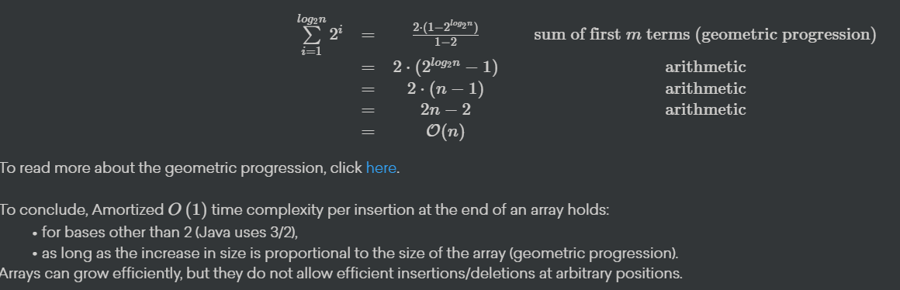

# Week 3 - Positional Lists, Iterators, Priority Queues, Heaps, Search Algorithm

# List Abstractions

The following operations are part of the Java List interface:

- *size()* > gets the size
- *isEmpty()* > gets whether the list is empty
- *get(i)* > gets the element at index
- *set(i, e)* > replaces the element at index
- *add(i, e)* > adds the element from index
- *remove(i)* > removes the element from index

### Array implementation

Usual insertion / deletion algorithm for arrays, but if the max capacity of array is reached, insertion at the end goes from O(n) to much larger. But this happend rarely, so we think about amortised complexity. Size doubling happend when n is a power of 2. Thus, there are O(log n) operations of resizing each with cost O(2^i) where i is in {1,2, … log n} → 



### Positional List based

An array element can easily be accessed by index, but the index can shift as new items get added and old items get removed. In order to add or get an element at an arbitrary position in a list we can use a positional list. This list uses a position interface which describes only 1 method: *getElement().* Internally, this interface is implemented with more methods; for example *next* and *prev.* This means that the you can't call those methods as they are not in the *Position* interface, but using a direct reference to the class which implements the interface you can. So we encapsulate those methods so that you can't traverse the list outside of the positional list class. 

The following methods are in the positional list spec:

- *before(p) / after(p)*
- *addBefore(p, e) / addAfter(p, e)*
- *set(p, e)*
- *remove(p)*

## Iterator

- Lazy Iterator
    - goes through the list normally but if the list changes while iterator is iterating, the iterator will also change
- Snapshot Iterator
    - - makes a copy of the collection upon creation, so if the list changes while it is iterating, the iteration will not be affected (because it s working on a copy)

# Priority Queue

A priority queue is a collection of prioritized elements.

- insert at any arbitrary position (when you insert / enqueue it doesn’t go at the end, it goes where it would be in the right order depending on the property it s sorted by)
- remove element with the first priority

Priority Queue Entry (key, value)

- key is priority, it s what gives the priority
- value is the element

## Comparable

- Natural Ordering: a class defines a natural ordering of instances by implementing java.lang.comparable
- External Ordering: can be defined by another class: java.util.Comparator

### Operations on PQ:

- insert (k,v)
- min () return minimum key
- removeMin() take a guess
- size()
- isEmpty()

If you use *min* and *removeMin* with elements that have the same key, the returned value is arbitrary

**Priority**: A key associated with an element establishes its **priority**, usually numeric can be anything as long as there is a natural order.

For a comparison to be self-consistent, it must define a total order relation:

- *Comparability*: The rule is defined for every pair of keys
- *Anti-symmetry*: If the rule holds independently of the order of keys, the keys must be identical
- *Transivity*: if *aRb* and *bRc* then *aRc*
- *Reflexivity*: *aRa*

Minimal key is always: *kmin*≤*k* where *k* are all the other keys in the queue

Implementations:

- Unsorted List: addition is done at the end in O(1) and removal is O(n) (it searches for min and then removes it)
- Sorted List: addition is O(n) because it should be added in the right spot and then removal is O(1) from the end
- Heap (see heaps)


### Adaptable Priority Queue

It s a priority queue with bonus:

- Remove (remove entry from pq)
- replaceKey (replaces the key of an entry with new key) // probably would need re insertion
- replaceValue (replaces value of an entry with a new value)

### Implementations of Adaptable PQ

- To implement these new methods efficiently, we need to store the location of each entry in the underlying structure (e.g. array) in the entry itself. So we would store the index of the entry in the entry if we are working with an array
    - For example, for Element x = pq.removeMin(), x has x.getIndex() which returns the index at which it was stored in the array.
    
    
    

# Heaps. (warning ! it s harder)

### Definition

- Heap is an efficient realization of a PriorityQueue that allows insertion and removal in O(n) time by thinking about it as a BinaryTree.

A heap is a complete binary tree storing entries as positions. All levels except possible the last are full (level i has 2^i nodes for 0≤ i≤ h -1  where h  is the height of the heap)

The remaining nodes in the last level occupy the leftmost positions.

Heap Order for every position p except the root, the key at p is greater or equal to the key of its parent (so the root is the smallest element)

Height is log (n) where n is nr of elements

- max heap is the heap where the root is the max element
- min heap is where root is min element

# Operations

### Insert

- create new node
- to preserve heap order, (q parent, p is node), compare key to its parent, if order not satisfied, swap
- Up Heap Bubbling start at the bottom, each pairwise swap between a node and its parent either
    - re establishes heap order
    - propagates the issue one level up
        - O(log n) complexity (because log n levels)

### RemoveMin

- entry with min is the root
- we cant delete root to preserve completness, we replace root with last node and then we down - bubble
    - then remove last entry

## Implementations:

- arrays: especially suited for complete binary trees (heaps), for node at index p, 2p+1 is left child, 2p+2 is right child !!!!!!!!!!
- linked tree
    - locating last pos is O(1), O (log n ) in total
    - local swapping between parrent/child
        - for accessing, Array is O(1) but tree alwasys requires traversal for access, so it ‘s O(log n)

## Heap Construction

- Bottom up heap merging
    - we take 2 heaps and add new key
    - we make the key the root and the 2 heaps it s children
    - we use down heap bubbling to restore heap order
- Bottom up heap construction
    - we start with empty heap and insert method for every new key
    - every iteration we insert n+1/2i nodes, where i is the number of the iteration. Then we perform up heap bullbing to restore heap order
    - after hitting root node we re done
- This takes O(n).


## Down Heap bubbling

- for min heap
    - swap with child with smallest key until we reach end of tree
- for max heap
    - swap with biggest child until we reach down
    
    ```java
    package weblab;
    
    import java.util.*;
    
    class MaxHeap {
    
        int[] arr;
    
        int size;
    
        // All methods below are available to use in your solution
    
        /**
         * Returns the number of elements in the heap.
         *
         * @return the current number of elements in the heap
         */
        public int size() {
            return this.size;
        }
    
        /**
         * Retrieves and removes the first element of this heap.
         *
         * @return The first element of the heap.
         */
        public int poll() {
            if (size == 0) {
                throw new NoSuchElementException("Cannot poll empty heap!");
            }
            int res = arr[0];
            swap(0, --size);
            arr[size] = 0;
            downHeap(0);
            return res;
        }
    
        /**
         * Turns the array of integers into a heap.
         * This is an in-place algorithm, the heap is built in the array itself.
         * <p>
         * On return, this heap's array represents a valid heap.
         */
        protected void heapify() {
            int n = this.arr.length - 1;
            for (int i = (n - 1) / 2; i >= 0; i--) downHeap(i);
        }
    
        /**
         * Restores the heap property in a heap represented as an array
         * by performing upheap on a certain item.
         *
         * @param index Index of the node to perform upheap on.
         */
        protected void upHeap(int index) {
            while (index >= 1) {
                int j = (index - 1) / 2;
                if (arr[j] >= arr[index]) break;
                swap(j, index);
                index = j;
            }
        }
    
        /**
         * Swaps two elements in the array.
         *
         * @param i Position of element to swap.
         * @param j Position of element to swap.
         */
        protected void swap(int i, int j) {
            int t = arr[i];
            arr[i] = arr[j];
            arr[j] = t;
        }
    
        /**
         * Creates a new MaxHeap with an initial capacity of 4 elements.
         */
        public MaxHeap() {
            this.arr = new int[4];
            this.size = 0;
        }
    
        /**
         * Restores the heap property in a heap represented as an array
         * by performing downheap on a certain item.
         * This method takes O(log n) time.
         * Ties may be broken arbitrarily.
         *
         * @param index Index of the item to perform downheap on.
         *              You can assume the index given is always valid.
         */
        void downHeap(int index) {
            int left = 2 * index + 1;
            int right = 2 * index + 2;
            int largest = index;
            if (left < size && arr[left] > arr[largest]) {
                largest = left;
            }
            if (right < size && arr[right] > arr[largest]) {
                largest = right;
            }
            if (largest != index) {
                swap(index, largest);
                downHeap(largest);
            }
        }
    }
    ```
    

# Tree traversals

## InOrder traversal of the tree: (root is in)

- traverse left subtree
- visit root
- traverse right subtree

```java
public static void InOrder(Node node) {
        if (node == null) {
            return;
        }

        InOrder(node.left);

        /* then print the data of node */
        System.out.print(node.key + " ");

        /* now recur on right child */
        InOrder(node.right);
    }
```

## PreOrder traversal: (the root is pre)

- visit root
- traverse left subtree
- traverse right subtree

```java
void printPreorder(Node node)
    {
        if (node == null)
            return;
 
        /* first print data of node */
        System.out.print(node.key + " ");
 
        /* then recur on left subtree */
        printPreorder(node.left);
 
        /* now recur on right subtree */
        printPreorder(node.right);
    }
```


## PostOrder traversal: (root is post)

- visit left subtree
- viist right subtree
- visit root

```java
void printPostOrder(Node node)
    {
        if (node == null)
            return;
 
        /* first recur on left subtree */
        printPreorder(node.left);
 
        /* now recur on right subtree */
        printPreorder(node.right);

				/* print data of node */
        System.out.print(node.key + " ");
    }
```

## Breadth first traversal

Visit every node level by level.

```java
void BFS(int s)
    {
        // Mark all the vertices as not visited(By default
        // set as false)
        boolean visited[] = new boolean[V];
 
        // Create a queue for BFS
        LinkedList<Integer> queue = new LinkedList<Integer>();
 
        // Mark the current node as visited and enqueue it
        visited[s]=true;
        queue.add(s);
 
        while (queue.size() != 0)
        {
            // Dequeue a vertex from queue and print it
            s = queue.poll();
            System.out.print(s+" ");
 
            // Get all adjacent vertices of the dequeued vertex s
            // If a adjacent has not been visited, then mark it
            // visited and enqueue it
            Iterator<Integer> i = adj[s].listIterator();
            while (i.hasNext())
            {
                int n = i.next();
                if (!visited[n])
                {
                    visited[n] = true;
                    queue.add(n);
                }
            }
        }
    }
```

## Full binary tree

A tree where every node has either 0 or 2 children

## Complete binary tree

When all of the levels of a binary tree are entirely filled, except for the last level, which can contain 1 or 2 children nodes and is **filled from the left**, it is said to be a complete binary tree.

- also! The keys stored at each node of the tree must be comparable according to a total order relations of comparability, antisymmetry, and transitivity.

### N-ary tree

- tree where every node has a maximum (≤) of n children
    - a binary tree is a 2-ary tree